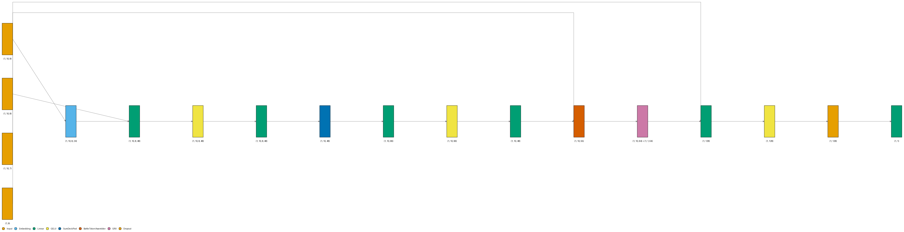
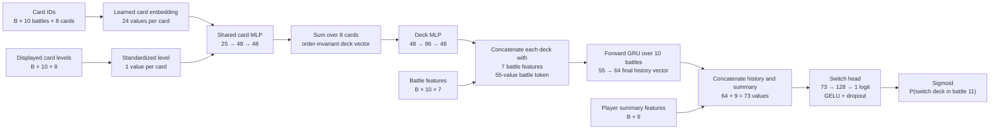
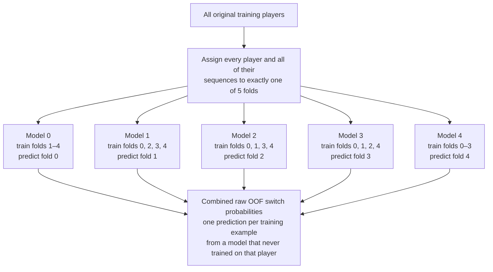
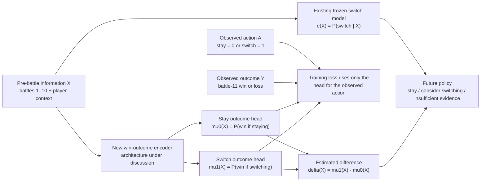

# Model architecture

This document separates the model that is already implemented from the outcome
and recommendation components that are still being designed.

## Current switch-propensity model — built

The current model predicts whether the player will use a different exact deck in
the next eligible battle. It does not predict whether switching is beneficial.

The following image is traced directly from the implemented PyTorch forward pass
using [VisualTorch](https://github.com/willyfh/visualtorch):

The simplified data-flow view below names the domain concepts represented by
those layers:

The seven per-battle model features are result, crown difference, deck-change
indicator, switch magnitude, time gap, trophies, and a trophies-missing flag.
The nine summary features describe longer-term switching behavior and current
deck familiarity.

Sum pooling intentionally makes the eight card positions interchangeable. Card
identity and level still affect the deck vector; only arbitrary card ordering is
discarded.

## Leakage-safe out-of-fold training — built

## Next outcome phase — proposed, not built

The next phase would use battle-11 win/loss as the observed outcome. The diagram
is conceptual: the exact outcome-head architecture and propensity adjustment
have not been selected yet.

Only the observed action and outcome are available during training. For example,
if a player stayed and won, the stay head receives that win label; there is no
invented label for what would have happened after switching.

Because no replacement deck is specified, the proposed switch outcome means the
average result of switching in the way similar players historically switched. It
does not represent the effect of switching to a particular deck.

## Implementation map

- Card and deck encoding: `models/card_encoder.py`
- Battle-token assembly: `models/battle_encoder.py`
- GRU and switch head: `models/history_encoder.py`
- End-to-end switch model: `models/switch_model.py`
- Sequential example construction: `crdata/sequences.py`
- Player splits and propensity folds: `crdata/switch_dataset.py`
- OOF switch training: `scripts/train_switch_oof.py`
