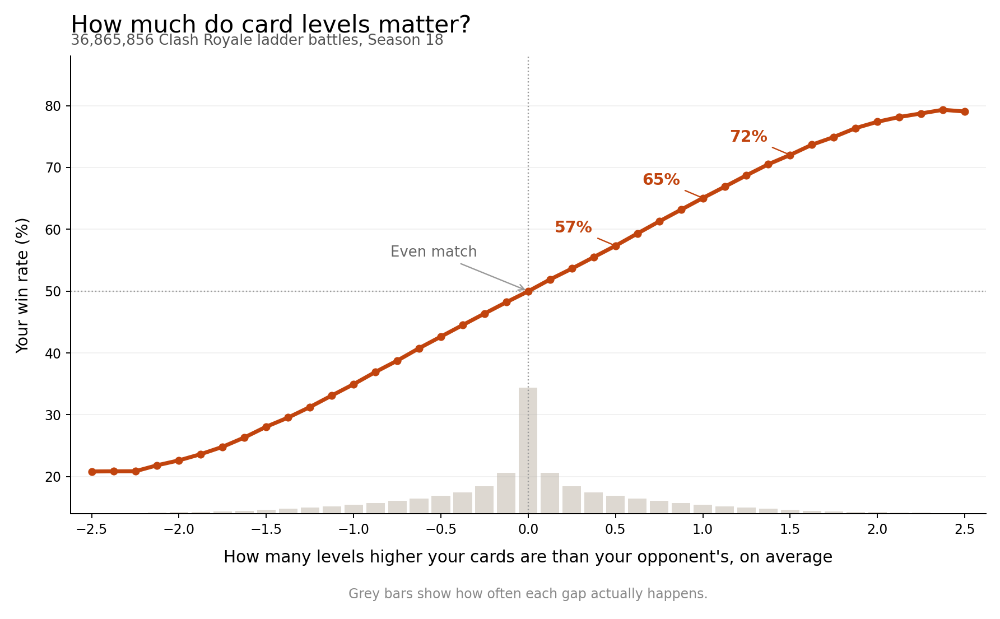

# clash2

Measuring what actually decides a Clash Royale match: deck design, player skill, or account investment.

The current focus is what a deck switch costs you, and how much of that cost is card levels rather than adaptation.
See `REPLICATION_SPEC.md`.

## Result so far

One card level of advantage takes you from a coin flip to **65 percent**, counted over 36,865,856 battles.



Every point is an observed win rate, not a prediction.
Details in `RESULTS_CARD_LEVEL.md`.

## Run it

```bash
python scripts/check_key.py
```

Confirms your API key works.
A 403 means the key needs `45.79.218.79` allowlisted at developer.clashroyale.com.

```bash
python scripts/seed_spread_cohort.py --target 10000
```

Builds a cohort of players spread evenly across five trophy bands.
Run once.

```bash
python scripts/collect.py
```

Polls every player in the cohort for their last 30 battles.
Run repeatedly, on a schedule.
Safe to re-run, because deduplication persists.

Needs Python 3.13, `pip install -r requirements.txt`, and a `.env` copied from `.env.example`.

## Where things are

Battles land in `data/battles/date=YYYY-MM-DD/`.
The cohort lives in `data/state/cohort_spread.parquet`.
None of `data/` is in git, because it regenerates and `players.parquet` alone is 201 MB.

`crdata/` holds the library, `scripts/` holds the entry points.

## Other documents

`DATA.md` lists every dataset and column.
`REPLICATION_SPEC.md` fixes the metrics and defines the question.
`API_FINDINGS.md` records measured Clash Royale API behaviour.
`ASSUMPTIONS.md` records what the estimates rest on.
`DECISIONS.md`, `REJECTED.md` and `CONVENTIONS.md` record what has been settled and why.
