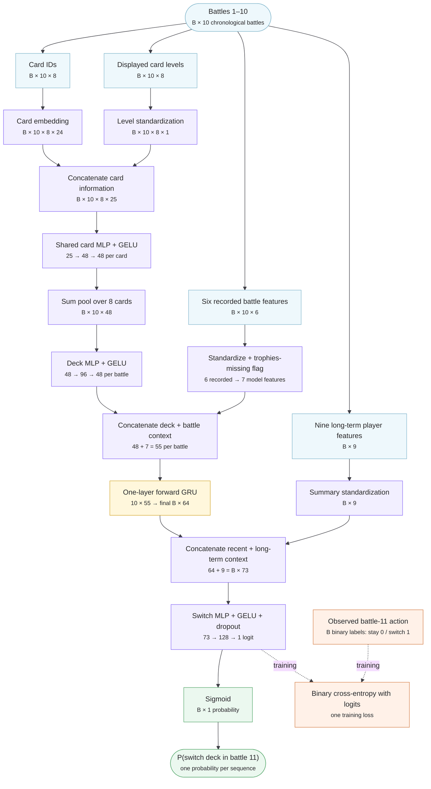
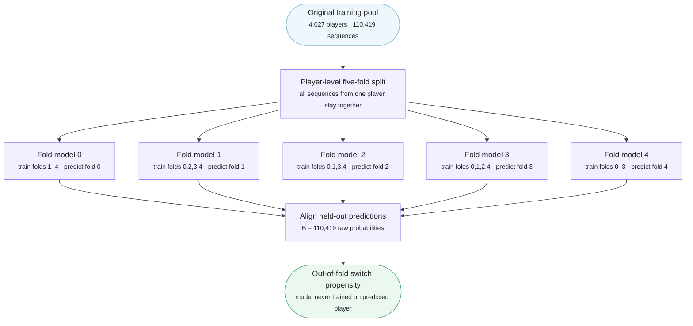
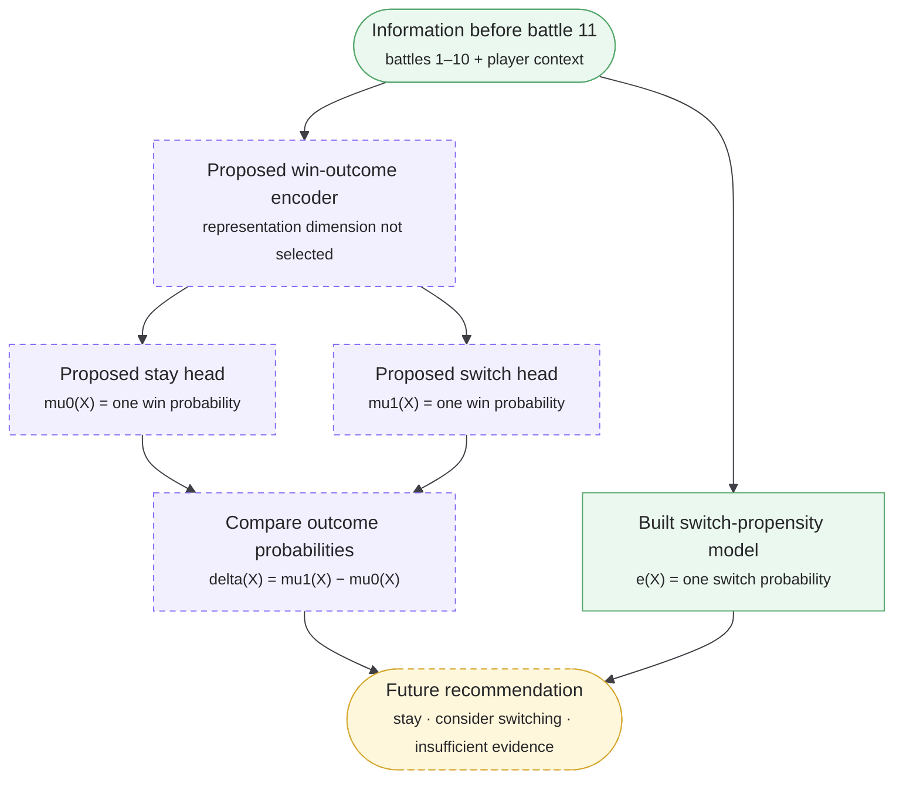

# clash2

When you win in Clash Royale, what are you actually winning with?
can we measure how much better some decks are than others?

this project attempts to: (measure aspects like skill) + create a recommendation algorithm that decides when a player should switch decks based off their recent battle history and behavioural type, and which deck to switch to.

## Architecture

`B` means batch size. The smaller line in each box shows the tensor dimension.

### Switch-propensity model — built

The implemented model uses battles 1–10 to estimate whether the player will
change their exact deck in battle 11.

### Player-level out-of-fold propensity training — built

Five copies of the model produce leakage-safe switch probabilities for the
future outcome phase. Every player's sequences remain together in one fold.

### Outcome phase — proposed, not built

See [ARCHITECTURE.md](ARCHITECTURE.md) for the feature definitions,
implementation map, and additional notes.
