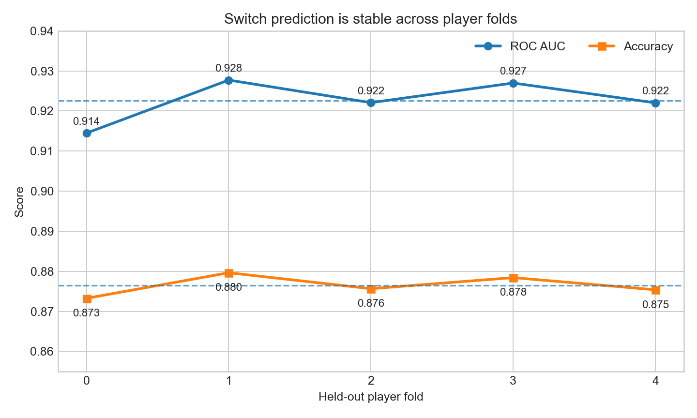
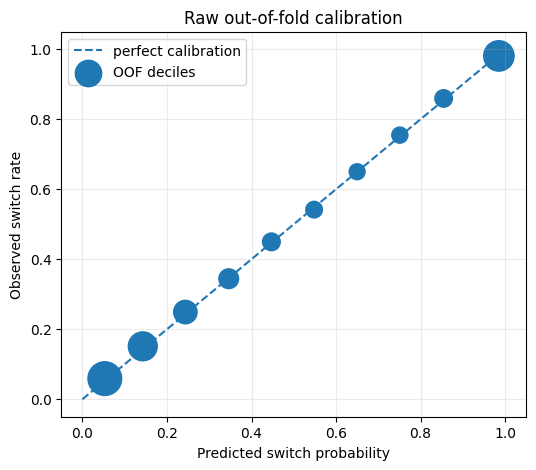
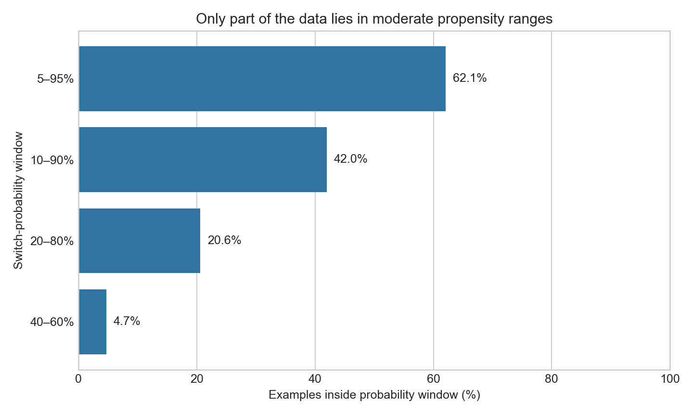

# Basic EDA: out-of-fold switch probabilities

## Question

Can the switch model provide reliable probabilities for later outcome-head
training, and how much of the data has a realistic chance of either staying or
switching?

This report uses the executed `train_switch_oof_colab.ipynb`. The model predicts
whether a player switches decks in battle 11 using battles 1–10. Each prediction
was made by a model that did not train on that player.

## 1. Performance across player folds

The five held-out player groups behave similarly. ROC AUC ranges from 0.914 to
0.928, and accuracy ranges from 0.873 to 0.880. No fold failed or performed very
differently from the others.

| Pooled metric | Value |
|---|---:|
| Log loss | 0.3102 |
| ROC AUC | 0.9226 |
| Average precision | 0.9144 |
| Brier score | 0.0939 |
| Calibration error | 0.0055 |
| Accuracy | 0.8765 |

**Interpretation:** the switch head generalizes well to players it did not see
during training.

## 2. Are the probabilities believable?

The dots are close to the dashed perfect-calibration line. For example, examples
assigned a switch probability near 50% switch approximately 50% of the time.

**Interpretation:** the raw probabilities are already well calibrated overall.
A separate calibration model is not necessary yet.

## 3. How much overlap is available?

A probability window describes examples where both actions remain reasonably
possible. For example, the 10–90% window excludes players predicted to have less
than a 10% or greater than a 90% chance of switching.

- 62.1% of examples are inside the broad 5–95% window.
- 42.0% are inside the 10–90% window.
- 20.6% are inside the 20–80% window.
- Only 4.7% are close to a 50/50 decision, inside the 40–60% window.

**Interpretation:** behavior is often highly predictable. That is good for the
switch head, but it limits causal comparisons. At very low switch probabilities,
the switch outcome head would have little evidence. At very high probabilities,
the stay outcome head would have little evidence.

## Current decision

The out-of-fold switch probabilities are good enough to keep. The future system
should not make confident stay-versus-switch comparisons for every example.
Extreme-propensity cases are natural candidates for **insufficient evidence**.

Before choosing an outcome-head loss or a final cutoff, one additional diagnostic
is needed: plot the probability distribution separately for observed switchers
and stayers, then calculate inverse-propensity weight ranges and effective sample
sizes. Those values were not printed into the executed notebook, so they cannot
be reconstructed from its saved aggregate output alone.
